

  
  
  <h1>Gufit - Full-Stack Fitness Management Platform</h1>
  
  
A comprehensive, cross-platform ecosystem designed for fitness professionals and their trainees, streamlining workout plans, progress tracking, and client management.

  

    
    
    
    
  

 

> **Note:** This repository serves as a showcase for the **Gufit** platform. The core source code is kept private as it is a proprietary, commercially viable product currently operating in production.

## 📱 About The Project

Gufit bridges the gap between fitness coaches and their trainees. By providing a dedicated mobile application for users and a powerful web dashboard for coaches, Gufit digitizes the entire training lifecycle. 

Built solo from the ground up, the platform handles user authentication, real-time database syncing, media uploads (workout videos), and complex relational data between trainers and trainees.

### Key Capabilities
- **For Trainees (Mobile App):** View assigned daily workouts, track weights and reps, watch exercise tutorial videos, and communicate with the coach.
- **For Coaches (Web Dashboard):** Manage a roster of clients, build custom workout templates, assign weekly schedules, and monitor trainee progress and analytics.

---

## 🛠️ Technology Stack

Gufit is built using a modern, scalable full-stack JavaScript architecture.

### Frontend
* **React Native (Expo)** - For building the cross-platform (iOS/Android) mobile application.
* **React.js** - For the Coach Web Dashboard.
* **Redux / Context API** - For state management.

### Backend
* **Node.js & Express.js** - RESTful API serving as the backbone of the platform.
* **MongoDB (Mongoose)** - NoSQL database optimized for flexible workout schemas and user relationships.
* **Firebase** - Utilized for secure user authentication (Auth) and media storage (Cloud Storage for videos/images).
* **Railway** - Cloud hosting platform for deploying the backend services with CI/CD integration.

---

## 📸 Screenshots & UI Showcase

*(Replace the placeholder images below with your actual screenshots by placing them in the `screenshots` folder)*

### Mobile App (Trainee View)

  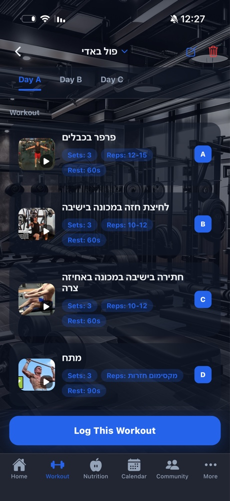
  &nbsp;&nbsp;
  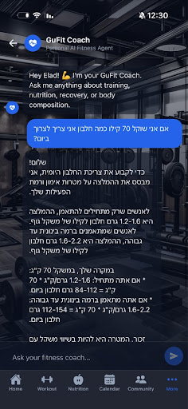
  &nbsp;&nbsp;
  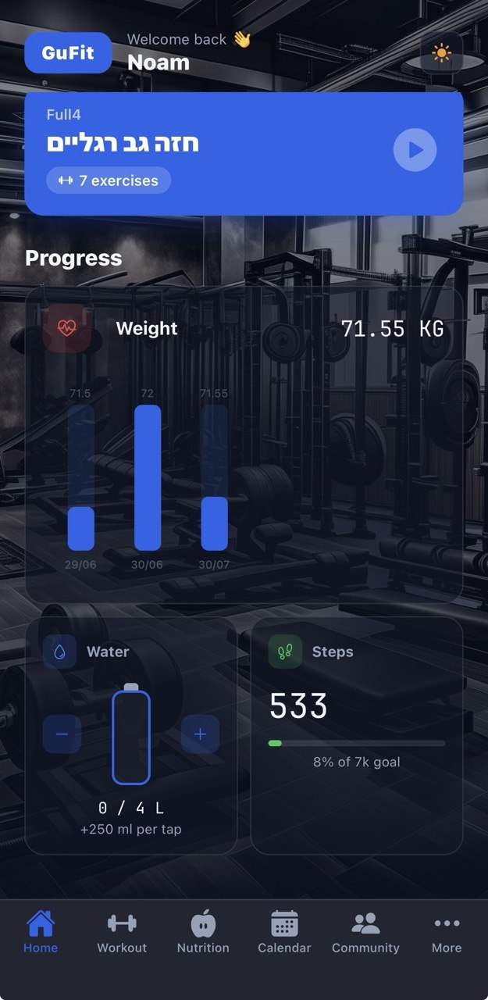

  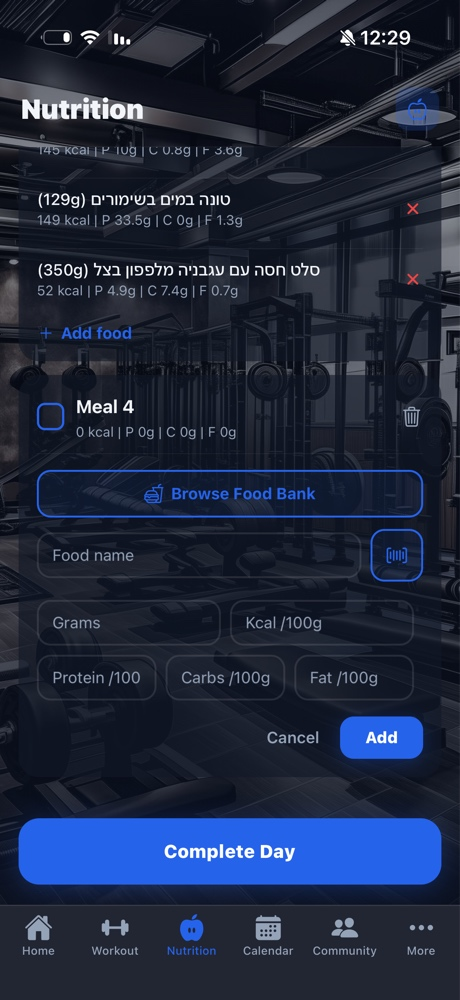
  &nbsp;&nbsp;
  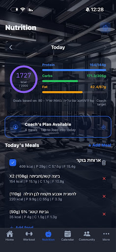
  &nbsp;&nbsp;
  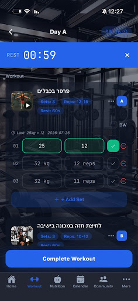

  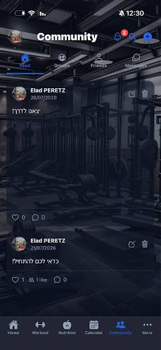
  &nbsp;&nbsp;
  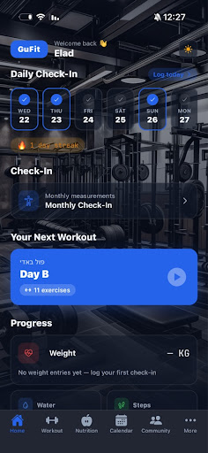
  &nbsp;&nbsp;
  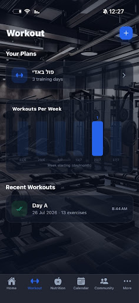

  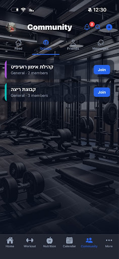
  &nbsp;&nbsp;

### Web Dashboard (Coach View)

  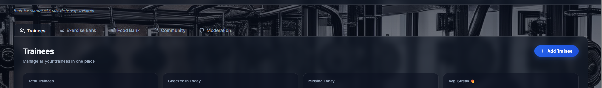

  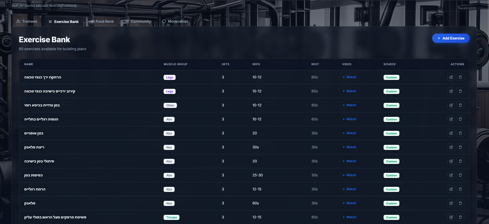

  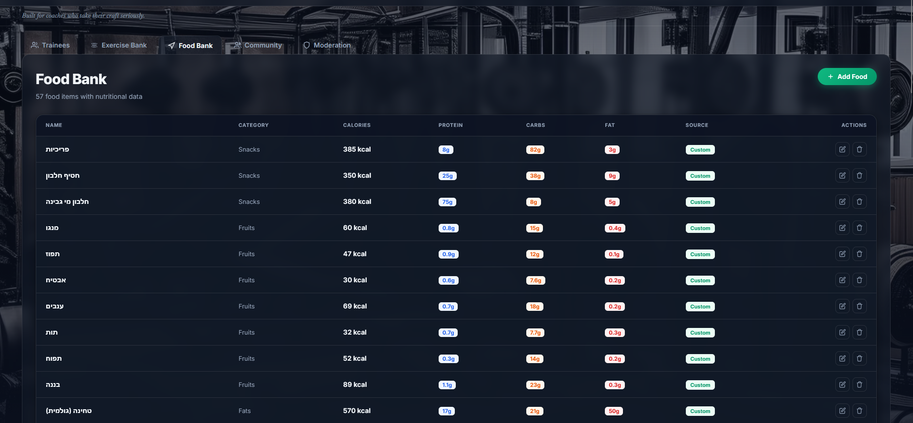

  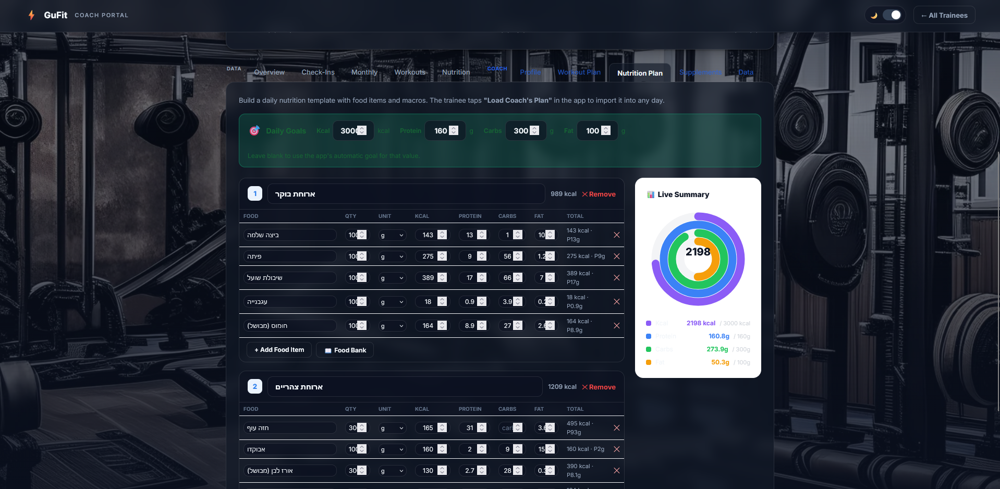

  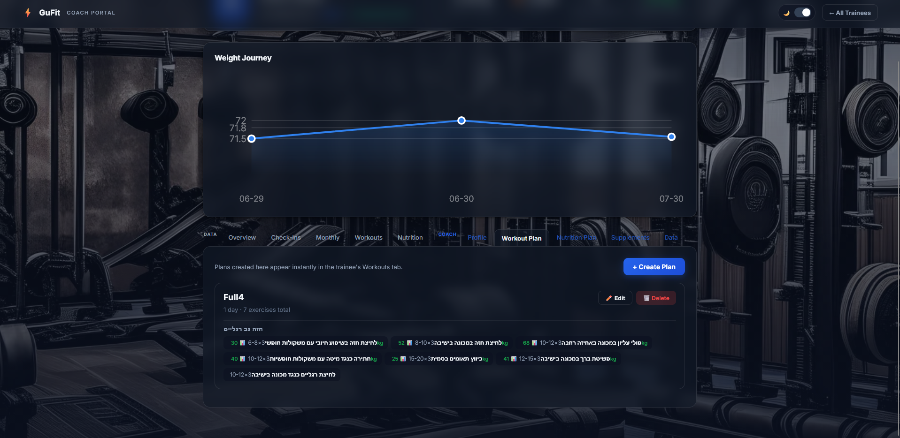

  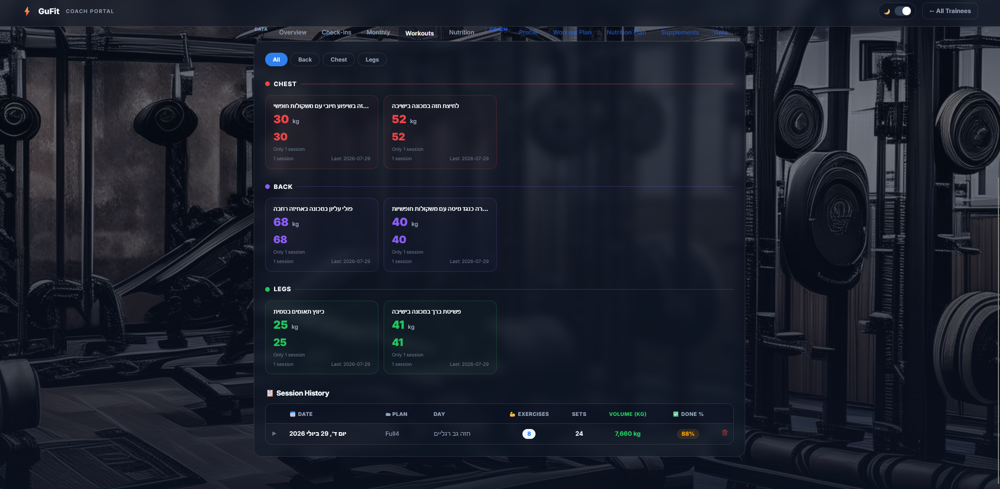

  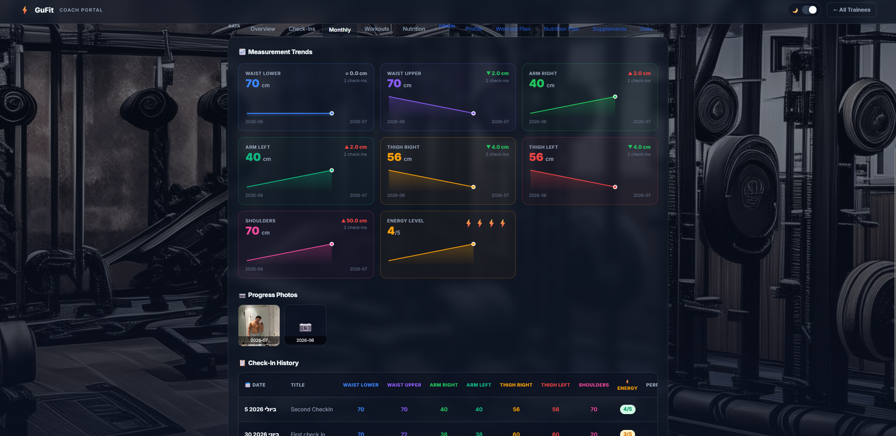

---

## 💡 Architecture & Implementation Details

1. **Scalability:** The MongoDB schema is designed to separate heavy exercise catalogs from daily assigned logs, allowing fast query times even as a trainee's history grows.
2. **Security:** All API endpoints are protected using Firebase JWT tokens. Middleware validates user roles (Trainee vs. Coach) before granting access to specific data points.
3. **Media Handling:** Video uploads from the dashboard are compressed and securely streamed to the mobile client using Firebase Storage buckets.

---

  
Designed and Developed by <b>Noam Hadad</b>

  <a href="https://www.linkedin.com/in/noamhadad1234">LinkedIn</a> • 
  <a href="mailto:noam.d.hadad@gmail.com">Email</a>

